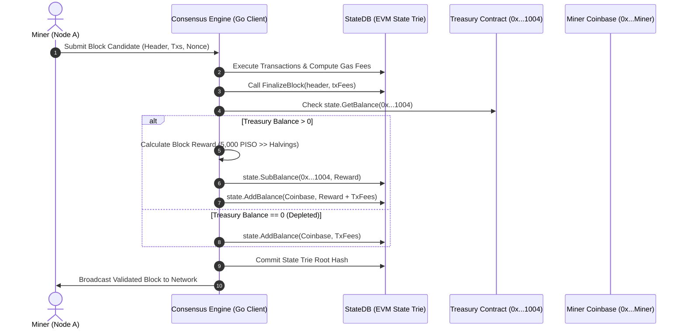
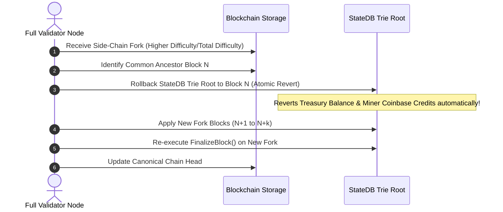

# PISO Chain Treasury-Based Native Coin Mining System Specification

> **Architectural Specification & Production Implementation**
> **Protocol Standard**: Native PISO Non-Inflationary Treasury Payout Engine
> **Chain ID**: `2026001` | **Native Currency**: PISO | **Max Supply**: 100,000,000,000 PISO (Fixed 0% Inflation)

---

## 1. Overview & Core Invariants

PISO Chain utilizes a **Decentralized Treasury-Based Mining Reward System**. Unlike traditional PoW networks (such as Bitcoin or Ethereum pre-Merge) that mint new coins out of thin air on every block, PISO Chain enforces a **zero-inflation fixed maximum supply of 100,000,000,000 PISO**.

### Protocol Invariants
1. **Fixed Maximum Supply**: The total native PISO coin supply is permanently capped at `100,000,000,000 PISO` (`100_000_000_000 * 10^18 wei`). No `mint()` function or additional coin generation code exists anywhere in the protocol.
2. **Pre-Minted Mining Allocation**: 60% of the total supply (60,000,000,000 PISO) is locked at Genesis into the **System Treasury Contract Address** (`0x0000000000000000000000000000000000001004`).
3. **Consensus Payout Engine**: Miners receive block rewards automatically transferred from the Treasury contract balance to `block.coinbase` by the client's consensus state transition engine during block finalization.
4. **No Developer Control**: The Treasury contract address has **no private key, no admin owner, and no withdrawal functions**. Only consensus rules can trigger balance deductions.
5. **Smooth Depletion Transition**: When the Treasury balance reaches zero, the block reward automatically drops to 0, and miners transition to receiving transaction fees (`baseFee` burn + `priorityFee` tip) exclusively.

---

## 2. Complete Protocol Architecture & Workflows

### Sequence Diagram 1: Block Validation & Consensus Treasury Payout

---

### Sequence Diagram 2: Chain Reorganization & State Rollback Flow

---

## 3. Halving Schedule & Depletion Economics

### Halving Parameters
- **Initial Block Reward**: 5,000 PISO
- **Halving Interval**: 5,000,000 blocks (~6 months at 3-second block finality)
- **Treasury Allocation**: 60,000,000,000 PISO (60,000,000,000 * 10^18 wei)

| Halving Epoch | Block Range | Block Reward (PISO) | PISO Distributed per Epoch | Cumulative PISO Distributed | Remaining Treasury Balance |
| :--- | :--- | :--- | :--- | :--- | :--- |
| **Epoch 0** | 0 – 4,999,999 | 5,000.00 | 25,000,000,000 | 25,000,000,000 | 35,000,000,000 |
| **Epoch 1** | 5,000,000 – 9,999,999 | 2,500.00 | 12,500,000,000 | 37,500,000,000 | 22,500,000,000 |
| **Epoch 2** | 10,000,000 – 14,999,999 | 1,250.00 | 6,250,000,000 | 43,750,000,000 | 16,250,000,000 |
| **Epoch 3** | 15,000,000 – 19,999,999 | 625.00 | 3,125,000,000 | 46,875,000,000 | 13,125,000,000 |
| **Epoch 4** | 20,000,000 – 24,999,999 | 312.50 | 1,562,500,000 | 48,437,500,000 | 11,562,500,000 |
| **Epoch 5** | 25,000,000 – 29,999,999 | 156.25 | 781,250,000 | 49,218,750,000 | 10,781,250,000 |
| **Depletion**| ~ Block 38,000,000 | 0.00 (Tx Fees Only) | — | 60,000,000,000 | 0 (Tx Fees Only) |

---

## 4. Economic Comparison Matrix

| Metric / Feature | **PISO Chain** | **Bitcoin (BTC)** | **Litecoin (LTC)** | **Ethereum (ETH)** | **Kaspa (KAS)** | **Monero (XMR)** |
| :--- | :--- | :--- | :--- | :--- | :--- | :--- |
| **Consensus Type** | Parlia PoSA / PoW Hybrid | PoW (SHA-256) | PoW (Scrypt) | PoS (Casper) | BlockDAG PoW | PoW (RandomX) |
| **Max Supply Cap** | **100 Billion (Fixed)** | 21 Million | 84 Million | Infinite | 28.7 Billion | Tail Emission |
| **New Coin Minting**| **0% (Zero Minting)** | Yes (Coinbase) | Yes (Coinbase) | Yes (Staking) | Yes (Chroma) | Yes (Tail Emission) |
| **Mining Reward Source** | **Pre-Minted Treasury** | New Inflation | New Inflation | Staking Issuance| New Inflation | New Inflation |
| **Block Time** | **3.0 Seconds** | 10 Minutes | 2.5 Minutes | 12 Seconds | 1.0 Second | 2.0 Minutes |
| **EVM Execution** | **100% Native EVM** | No | No | Native EVM | No | No |
| **Post-Depletion**| **Tx Fees Only** | Tx Fees Only | Tx Fees Only | Tx Fees Only | Tx Fees Only | Continuous Tail |

---

## 5. Security Analysis & Attack Vectors

### 1. Reorg & Replay Protection
- **Attack Vector**: An attacker attempts a block reorganization to trigger double payout of treasury funds for orphaned blocks.
- **Protocol Mitigation**: Treasury payouts are processed natively inside `stateDB.SubBalance()` during state transitions. When a node switches canonical chains during a reorg, the EVM state trie root automatically reverts to the common ancestor state root. Treasury balances and miner accounts are atomically restored.

### 2. Treasury Draining Attack
- **Attack Vector**: A malicious contract or user calls `0x0000000000000000000000000000000000001004` to withdraw PISO coins.
- **Protocol Mitigation**: The Treasury system contract [`contracts/PISOMiningTreasury.sol`](file:///c:/Users/janla/piso-chain/piso-chain/contracts/PISOMiningTreasury.sol) contains **no external transfer functions**, **no withdrawal routines**, and **no administrative keys**. Only the Go consensus engine `state.SubBalance()` can mutate its balance.

### 3. Developer Centralization Risk & Migration Plan
- **Risk**: 100% of native PISO supply pre-minted at genesis in developer wallet creates rug-pull risk.
- **Decentralized Migration**: 
  1. In `genesis.json`, 60 Billion PISO (60% of total supply) is locked directly into `0x0000000000000000000000000000000000001004`.
  2. 40 Billion PISO (40%) is placed into ecosystem, bridge liquidity, and long-term locked governance vaults.

---

## 6. Client Modification Guide

### Files to Modify in Core Blockchain Clients

#### Geth / BSC (Go-Ethereum & BSC Parlia)
1. **`core/state_processor.go`**:
   - In `Process()`, invoke `consensus.FinalizePISOTreasuryMiningBlock(stateDB, header, txFees)` inside `FinalizeBlock()`.
2. **`consensus/parlia/parlia.go`**:
   - In `accumulateRewards()`, replace minting logic with Treasury balance transfer.

#### Polygon Edge
1. **`state/executor.go`**:
   - In `ProcessBlock()`, call `ProcessPolygonEdgeTreasuryPayout(stateDB, coinbase, blockNumber, txFees)`.

#### Erigon
1. **`core/state_processor.go`**:
   - Update state transition engine to perform atomic subtraction on treasury precompile `0x...1004`.

---

## 7. Production Code Listings

### A. Solidity System Contract (`contracts/PISOMiningTreasury.sol`)
See [`contracts/PISOMiningTreasury.sol`](file:///c:/Users/janla/piso-chain/piso-chain/contracts/PISOMiningTreasury.sol).

### B. Python Protocol Reference Engine (`core/treasury_mining.py`)
See [`core/treasury_mining.py`](file:///c:/Users/janla/piso-chain/piso-chain/core/treasury_mining.py).

### C. Go Client Patch (`consensus/consensus_patch_geth_bsc.go`)
See [`consensus/consensus_patch_geth_bsc.go`](file:///c:/Users/janla/piso-chain/piso-chain/consensus/consensus_patch_geth_bsc.go).

### D. Genesis Allocation (`genesis.json`)
See [`genesis.json`](file:///c:/Users/janla/piso-chain/piso-chain/genesis.json).
